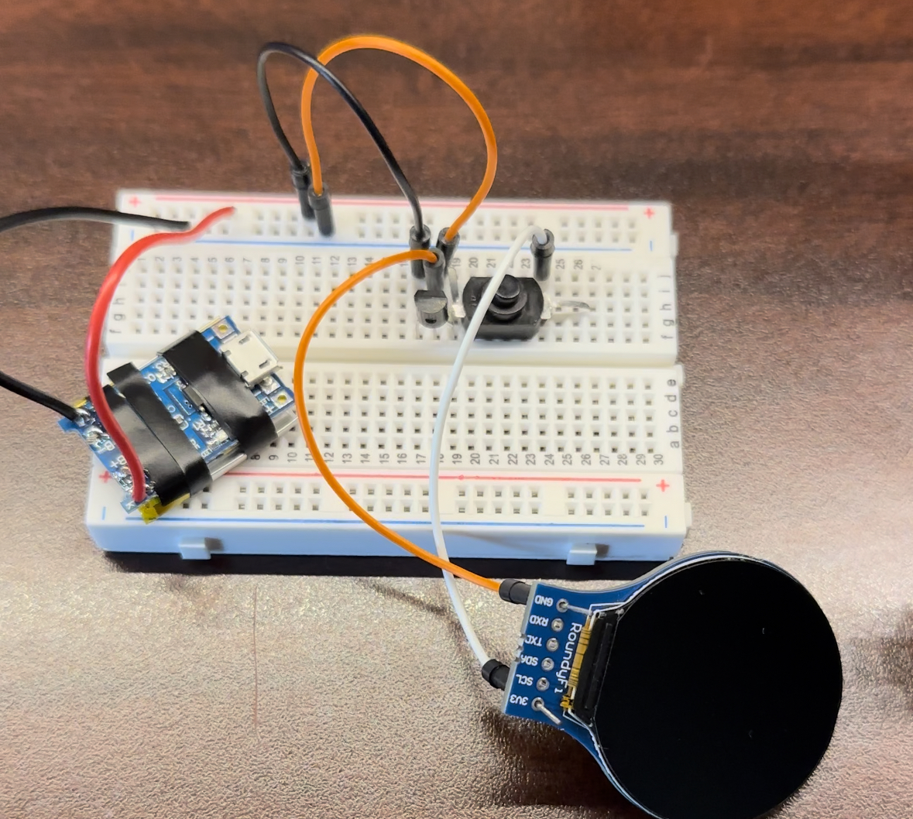

# Project Watch
Project Watch is my attempt at building my own smart watch. 

# Parts
Version 1 of Project Watch is named "Big Bertha" and is built using parts that can be purchased from Amazon and Adafruit. This means it has no custom PCB or components.

* [Watch Band](https://www.amazon.com/WOCCI-Adjustable-Nylon-Watch-Release/dp/B0BNKFJ9MD/ref=sr_1_2?crid=3IYJIVPGSMSH0&keywords=watch%2Bband&qid=1677020964&sprefix=watch%2Bband%2Caps%2C130&sr=8-2&th=1&psc=1)
* [Battery](https://www.adafruit.com/product/1317)
* [Charging Module](https://www.amazon.com/Mudder-Pieces-Charging-Battery-Protection/dp/B087Q915LF/ref=sr_1_4?crid=50TX8NDRR3KZ&keywords=charging+module&qid=1677021038&sprefix=charging+modul%2Caps%2C119&sr=8-4)
* [Voltage Regulator](https://www.adafruit.com/product/2166)
* [Power Switch](https://www.amazon.com/mxuteuk-Self-Lock-Flashlight-Latching-BK-1208/dp/B086L2GPGX/ref=sr_1_1?crid=CORBIVLCGQ17&keywords=mxuteuk+50pcs&qid=1677021168&sprefix=mxuteuk+50pc%2Caps%2C109&sr=8-1)
* [RoundyFi](https://www.amazon.com/RoundyFi-Compact-Transceiver-Resolution-Interface/dp/B0B28ZHFK4/ref=sr_1_1?crid=1LA2V60PYWFJH&keywords=roundyfi&qid=1677021276&sprefix=roundyfi%2Caps%2C103&sr=8-1)

# Watch Images
